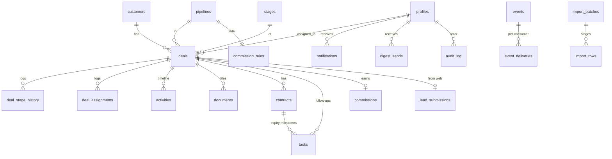
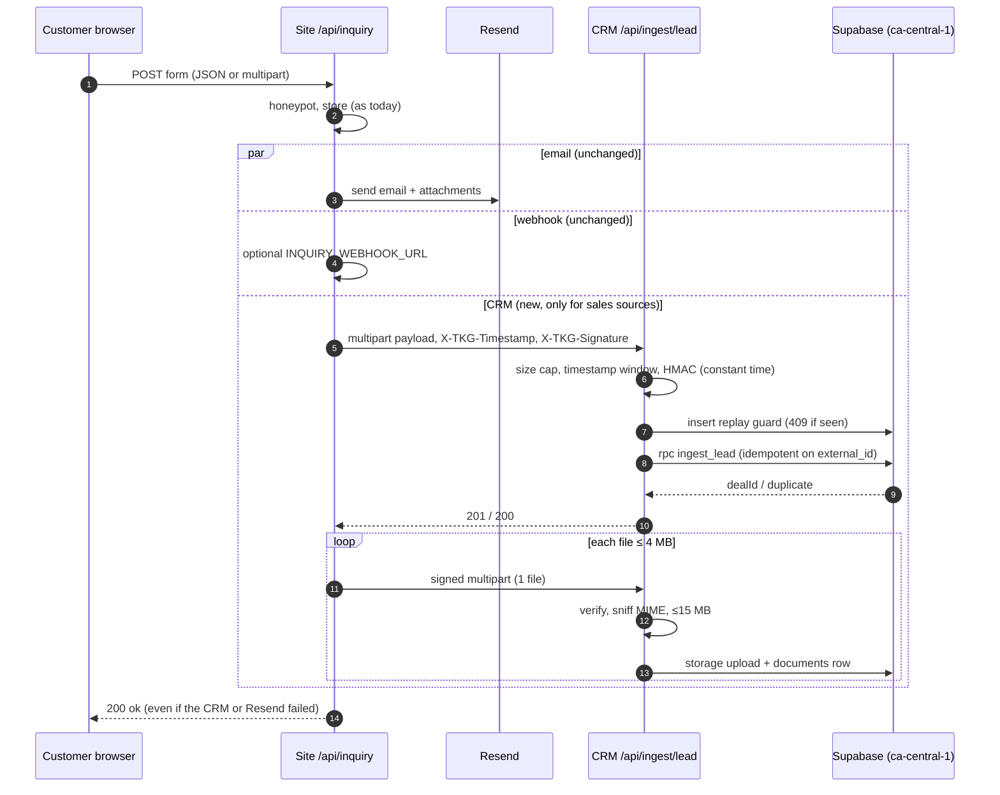

# TKG CRM — Phase 0 plan

Status: **approved 2026-09-26** with the answers in §13. **§13 overrides any
earlier section it conflicts with.** Phase 1 is blocked until the toolchain is installed (§10).
Date: 2026-09-26. Author: Claude (Phase 0 read-and-plan).

Target: `crm.tkgventuresltd.ca`, a separate Next.js App Router app in `/crm`,
deployed as its own Vercel project (Root Directory = `crm`), backed by Supabase
(Postgres + Auth + private Storage) in `ca-central-1`.

---

## 0. What I read, and what it changes

| File | Finding that shapes the plan |
| --- | --- |
| `src/app/api/inquiry/route.ts` | `notify()` already runs `email()` and `webhook()` in `Promise.all` and never throws. The CRM forward becomes a third branch in that `Promise.all`, so the email path is not touched. Uploads arrive as `File[]` and are already in memory. |
| `src/lib/store.ts` | Record id is `randomUUID()`. When the store write fails, the route uses `unstored-<base36>`. On the VPS (deploy.sh), the store persists. On Vercel it doesn't. |
| `src/lib/submit-inquiry.ts` + pages | The **actual** `source` strings are `division:<slug>`, `automotive:sourcing`, `automotive:selling`, `page:contact`, `page:quote`, `careers:<positionId>` / `careers:unspecified`. (`topicFor()` checks `'contact'`/`'quote'`, which never match, but that is display-only and I won't change it.) |
| `src/config/general-forms.ts` | Quote: `division` is required and may be `not-sure`. Contact: `division` is optional and may be `general` or `not-sure`. Contact `phone` is optional, but `email` is always required (`commonFields`). |
| `src/config/careers.ts` | Careers use `applicationForm` with source `careers:*`, a resume upload, and personal data we must never ingest. |
| `src/config/automotive.ts` | Two more **sales** forms (sourcing, selling) exist outside `divisions.ts`. They map to the Automotive pipeline. |
| `src/config/divisions.ts` / `theme.ts` | 8 divisions with `accent` / `accentInk` / `accentSoft` (AA-verified pairs). Chips use `accentSoft` background + `accentInk` text. |
| `src/lib/admin-auth.ts` | Independent HMAC cookie auth for `/admin`. Untouched. |
| `next.config.mjs`, `package.json` | Next 14.2.15, zod 3, react-hook-form 7. The site is `output: 'standalone'` for the VPS. None of this is shared with the CRM. |
| `.claude/` | Only `launch.json` (`tkg-dev` on :3000). The CRM will get its own launch entry in Phase 1. |
| Local machine | **`node`, `npm`, `docker`, `supabase` and `git` are not on PATH.** Phase 1 cannot run migrations or tests until they are installed (see §10). |

### Division/source → pipeline mapping (used by ingestion)

| `source` | Pipeline |
| --- | --- |
| `division:<slug>` where `<slug>` is an active pipeline | that pipeline |
| `automotive:sourcing`, `automotive:selling` | `automotive` |
| `page:quote` | `values.division` if it is an active pipeline slug, else `general` |
| `page:contact` | `values.division` if it is an active pipeline slug, else `general` (covers `general`, `not-sure`, blank) |
| `careers:*` | **never sent**. The site filters it, and the CRM rejects it with 422 and writes nothing |
| anything else | not sent (the site uses an allow-list, not a deny-list) |

---

## 1. Architecture summary

```
Browser (phone) ──HTTPS──► Vercel project "tkg-crm" (region yul1 / Montréal)
                             │  Next.js App Router (server components + server actions)
                             │  middleware: session refresh, idle timeout, active check, CSP nonce
                             ▼
                          Supabase ca-central-1
                             ├─ Postgres (RLS on every table, default deny)
                             ├─ Auth (invite-only, TOTP MFA)
                             ├─ Storage bucket `crm-documents` (private)
                             └─ pg_cron (daily expiry engine)

Marketing site ──signed POST (HMAC)──► /api/ingest/lead (+ /attachment)
Vercel Cron ──Bearer CRON_SECRET──► /api/cron/digest ──► Resend
```

Key decisions:

1. **The browser never talks to Supabase's REST or Auth API directly.** Every
   Supabase call runs on the server with the user's cookie session
   (`@supabase/ssr`). The publishable (anon) key is a **server-only** env var,
   not `NEXT_PUBLIC_`. That means login lockout can't be bypassed by calling
   GoTrue directly, and PostgREST isn't reachable from a browser.
   RLS is still written as if direct access were possible (defence in depth).
   The one browser→Supabase call is uploading a document to a single-use
   **signed upload URL** (§6.4).
2. **Authorization lives in Postgres.** Roles are read from `profiles` on
   every query through `SECURITY DEFINER` helper functions, not from JWT
   claims. A deactivated user or a role change takes effect on the next
   request, not at token expiry.
3. **Privileged side effects happen in triggers.** Stage history,
   assignment history, notifications, outbox events, commissions and audit
   rows are written by `SECURITY DEFINER` triggers. Users have no INSERT
   rights on those tables.
4. **No hard deletes.** `DELETE` is revoked from `anon`/`authenticated` on
   every table. A `BEFORE DELETE` trigger raises on every business table,
   even for the service role. Soft delete uses `deleted_at`/`deleted_by`, and
   only admins can set it (trigger-enforced).
5. **Service-role key** is imported only from `crm/src/server/privileged/**`.
   Those files start with `import 'server-only'`. A prebuild script fails the
   build if the variable name appears anywhere else, and a postbuild script
   scans `.next/static` for the name and the key value (§7.3). **See open
   question Q2:** user invite and deactivation need the Auth Admin API, which
   needs the service role.
6. **Money is stored as `bigint` cents (CAD).** Dates that have no time
   (installation, contract start/end) use `date`. Everything else uses
   `timestamptz`. "Today" always means `(now() at time zone 'America/Vancouver')::date`.
7. **Stages are global.** One `stages` table shared by every pipeline, which
   is what "every pipeline uses these stages" requires. Code refers to stages
   by `key` and never by name or id. A later move to per-pipeline stages would
   be additive.

---

## 2. ERD

All tables live in `public` with RLS **enabled**. Internal helper functions
live in schema `app`, which PostgREST doesn't expose. Every business table has
`created_at timestamptz default now()` and, where marked (SD), soft-delete
columns `deleted_at timestamptz null, deleted_by uuid null → profiles`.

### 2.1 Enums

| Enum | Values |
| --- | --- |
| `app_role` | `admin`, `sales_rep` *(add `manager` later with `ALTER TYPE … ADD VALUE`)* |
| `deal_source` | `web`, `manual`, `import`, `direct_add` |
| `activity_type` | `note`, `call`, `whatsapp`, `email`, `visit`, `stage_change`, `assignment`, `pipeline_move`, `document`, `contract`, `lead_created` |
| `task_type` | `follow_up`, `contract_expiry` |
| `task_status` | `open`, `done`, `cancelled` |
| `commission_type` | `flat`, `percent` |
| `commission_status` | `pending`, `approved`, `paid` *(+ whatever Q1 decides, e.g. `void`)* |
| `contract_status` | `active`, `renewed`, `ended`, `cancelled` |
| `document_status` | `pending`, `ready`, `rejected` |
| `document_kind` | `id`, `bill`, `contract`, `photo`, `other` |
| `import_status` | `draft`, `validated`, `committing`, `committed`, `failed` |

### 2.2 Tables

**profiles** — one row per staff user (1:1 `auth.users`)
| column | type | notes |
| --- | --- | --- |
| id | uuid PK | FK `auth.users(id)` |
| email | citext not null unique | |
| full_name | text not null | |
| role | app_role not null | from `app_metadata.role` set by the inviter |
| active | boolean not null default true | false = locked out of all data immediately |
| deactivated_at | timestamptz | |
| invited_by | uuid → profiles | |
| last_login_at | timestamptz | |
| created_at / updated_at | timestamptz | |

**org_settings** — single row (`id int PK check (id = 1)`)
| column | type | notes |
| --- | --- | --- |
| fallback_assignee_id | uuid → profiles | admin who receives tasks for unassigned deals |
| session_idle_minutes | int default 30 | |
| updated_by / updated_at | | |

**pipelines**
| column | type | notes |
| --- | --- | --- |
| id | uuid PK | |
| slug | text unique not null | matches the site's division slug; `general` for unsorted |
| name | text not null | |
| accent / accent_ink / accent_soft | text (`#RRGGBB` check) | copied from `divisions.ts` |
| sort_order | int | |
| is_active | boolean default true | deactivate instead of delete |
| is_system | boolean default false | true for `general`, which can't be deactivated |
| created_at / updated_at | | |

Seed (from `src/config/divisions.ts` on 2026-09-26, hand-written into a migration so no site code is imported):
`security-smart-home #5A3FC0`, `telecommunications #08718F`, `automotive #BC4A17`, `real-estate #1F5CA8`,
`moving-delivery #9A6206`, `cleaning #07786A`, `staffing #8A4BB0`, `business-services #4A7A1C`,
`general` "General / Unsorted" `#6F6960` (site `inkMute`, neutral).

**stages** (global, ordered)
| column | type | notes |
| --- | --- | --- |
| id | smallint PK | |
| key | text unique | `new_lead, contacted, appointment, sold, documents_pending, installation, completed, cancelled` |
| name | text | admin-renamable |
| position | smallint unique | 10…70, cancelled = 99 |
| is_sale | boolean | true for sold, documents_pending, installation, completed |
| is_terminal | boolean | completed, cancelled |
| requires_reason | boolean | cancelled |

**commission_rules** (one per pipeline)
| column | type | notes |
| --- | --- | --- |
| pipeline_id | uuid PK → pipelines | |
| type | commission_type | |
| flat_amount_cents | bigint ≥ 0 | used when flat |
| percent_bps | int 0–10000 | basis points, e.g. 750 = 7.5 % |
| is_active | boolean | |
| updated_by / updated_at | | |

**customers** (SD)
| column | type | notes |
| --- | --- | --- |
| id | uuid PK | |
| full_name | text not null (≤200) | |
| phone_raw | text | as typed |
| phone_e164 | text | libphonenumber-js, region CA; null if unparseable |
| phone_digits | text GENERATED (`regexp_replace(coalesce(phone_e164, phone_raw),'\D','','g')`) | trigram index, for format-agnostic search |
| email | citext | lowercased by a check |
| address | text (≤300) | single line, as picked on the site |
| city | text | optional |
| notes | text (≤5000) | |
| created_by | uuid → profiles, null for web | |
| created_at / updated_at | | |

Indexes: `phone_e164`, `email` (btree, partial `where deleted_at is null`), GIN trigram on `full_name`, `address`, `phone_digits`. Uniqueness isn't enforced (families share landlines), so dedupe uses an advisory lock (§5).

**deals** (SD)
| column | type | notes |
| --- | --- | --- |
| id | uuid PK | |
| customer_id | uuid → customers not null | |
| pipeline_id | uuid → pipelines not null | |
| stage_id | smallint → stages not null | |
| assigned_to | uuid → profiles | null = unassigned |
| source | deal_source | |
| source_detail | text | e.g. `division:cleaning`, `page:quote` |
| service | text (≤300) | human summary, e.g. "Internet + TV" |
| monthly_price_cents / one_time_price_cents | bigint ≥ 0 | |
| value_cents | bigint ≥ 0 | commission basis (see Q5) |
| installation_date | date | |
| cancel_reason | text | required when stage = cancelled (trigger) |
| sold_at / completed_at / cancelled_at | timestamptz | stamped by trigger on first entry |
| last_contacted_at | timestamptz | maintained by activity trigger |
| needs_review | boolean default false | set when a rep's manual lead matched another rep's customer (Q4) |
| created_by | uuid → profiles | |
| created_at / updated_at | | |

**deal_stage_history** (append-only)
`id bigint identity PK, deal_id, from_stage_id, to_stage_id, reason text, changed_by uuid, changed_at timestamptz`

**deal_assignments** (append-only)
`id bigint identity PK, deal_id, from_user_id, to_user_id, changed_by, changed_at`

**lead_submissions** — raw website payload (append-only)
| column | type | notes |
| --- | --- | --- |
| id | uuid PK | |
| external_id | text **unique** not null | the site's submission id = idempotency key |
| source | text | |
| payload | jsonb | full signed body, honeypot already stripped |
| payload_sha256 | text | |
| deal_id | uuid → deals | |
| customer_id | uuid → customers | |
| matched_existing_customer | boolean | |
| received_at | timestamptz | |

**contracts** (SD)
| column | type | notes |
| --- | --- | --- |
| id | uuid PK | |
| deal_id | uuid → deals not null | |
| customer_id | uuid → customers not null | denormalized for the Renewals view |
| start_date | date | |
| end_date | date | check `end_date >= start_date` |
| status | contract_status default active | |
| renewed_from_id | uuid → contracts | a renewal is a **new row** (see §8) |
| created_by / created_at / updated_at | | |

**documents** (SD)
| column | type | notes |
| --- | --- | --- |
| id | uuid PK | |
| deal_id | uuid → deals not null | |
| customer_id | uuid → customers not null | |
| storage_path | text unique | `deals/{deal_id}/{document_id}` — no user-supplied name in the path |
| original_name | text (≤255) | display only |
| mime_type | text | **sniffed** from magic bytes, not the header the client sends |
| size_bytes | int ≤ 15 728 640 | |
| sha256 | text | |
| kind | document_kind | |
| status | document_status | only `ready` is ever shown |
| source | deal_source | `web` for ingested attachments |
| uploaded_by | uuid → profiles, null for web | |
| created_at | | |

**activities** (SD, immutable otherwise)
| column | type | notes |
| --- | --- | --- |
| id | uuid PK | |
| deal_id | uuid → deals not null | every activity hangs off a deal, so rep visibility is exact |
| customer_id | uuid not null | |
| type | activity_type | |
| body | text (≤5000) | |
| occurred_at | timestamptz | defaults to now, and can be back-dated for "called yesterday" |
| actor_id | uuid → profiles, null = system | |
| metadata | jsonb | e.g. `{from_stage, to_stage}` |
| created_at | | |

**tasks** (SD)
| column | type | notes |
| --- | --- | --- |
| id | uuid PK | |
| deal_id | uuid → deals not null | |
| customer_id | uuid not null | |
| contract_id | uuid → contracts | null for follow-ups |
| milestone | smallint check in (120,90,60,30) | null for follow-ups |
| type | task_type | |
| title | text | |
| due_date | date | |
| assigned_to | uuid → profiles not null | |
| status | task_status | |
| completed_at / completed_by | | |
| **UNIQUE (contract_id, milestone)** | | idempotency for the expiry engine (NULLs don't collide) |

**notifications**
`id uuid PK, user_id → profiles, type text, title text, body text (≤300, no PII beyond customer name), link text (relative path), read_at, created_at`

**commissions**
| column | type | notes |
| --- | --- | --- |
| id | uuid PK | |
| deal_id | uuid **unique** → deals | one per deal |
| rep_id | uuid → profiles | the deal's assignee when it first reaches a sale stage |
| pipeline_id | uuid | |
| rule_type / rule_flat_cents / rule_percent_bps | snapshot | later rule edits don't rewrite history |
| deal_value_cents | bigint | snapshot |
| amount_cents | bigint | |
| status | commission_status | |
| earned_at | timestamptz | = deal.sold_at, used for monthly reports |
| approved_by / approved_at / paid_at | | |

**events** (outbox)
`id bigint identity PK, type text check in (lead.created, deal.stage_changed, deal.assigned, contract.expiry_milestone, activity.logged), payload jsonb (ids + minimal fields, no contact details), created_at, processed_at (set when every registered consumer has delivered)`

**event_deliveries** (per-consumer progress)
`event_id → events, consumer text, status (claimed|done|failed), attempts int, last_error text, claimed_at, processed_at, PRIMARY KEY (event_id, consumer)`

**digest_sends**
`id uuid PK, user_id → profiles, digest_date date, kind (rep|admin_unassigned), status (sending|sent|failed), resend_id text, item_count int, created_at, **UNIQUE (user_id, digest_date, kind)**`

**audit_log** (append-only, and even admins can't update or delete it)
`id bigint identity PK, occurred_at, actor_id, actor_role, action text, entity_type text, entity_id text, before jsonb, after jsonb, ip inet, user_agent text (≤300), metadata jsonb`
Actions: `auth.login_success`, `auth.login_failure`, `auth.lockout`, `auth.logout`, `auth.mfa_enrolled`, `user.invited`, `user.role_changed`, `user.deactivated`, `user.reactivated`, `deal.assigned`, `record.soft_deleted`, `export.csv`, `document.download`, `document.view`, `import.committed`, `pipeline.moved`.

**import_batches**
`id uuid PK, created_by, filename, row_count, mapping jsonb, date_format text, status import_status, summary jsonb, committed_at, created_at`

**import_rows**
`id bigint PK, batch_id → import_batches, row_number int, raw jsonb, normalized jsonb, errors jsonb, duplicate_of_customer_id uuid, action (create|attach|skip), result_deal_id uuid`

**ingest_replay_guard**
`signature_sha256 text PK, received_at` (rows older than 1 hour are purged by the daily job; that's not business data)

**login_attempts**
`id bigint PK, email_hash text (HMAC of the lowercased email, not the email), ip inet, success boolean, attempted_at`

### 2.3 Views (all `WITH (security_invoker = true)`, so RLS applies and a test enforces it)

- `v_deal_list`: deal + customer name/phone + pipeline chip + stage + rep name + last_contacted + nearest contract end.
- `v_renewals`: active contracts with `end_date` between today and today+120, `days_left`, `current_milestone` (the smallest of 120/90/60/30 that is ≥ days_left).
- `v_staff_directory` (via a `SECURITY DEFINER` function returning `id, full_name` only), so reps can see who did what on their own timeline without reading `profiles`.

### 2.4 Relationship diagram



---

## 3. RLS policy matrix

Helper functions (in `app`, `SECURITY DEFINER`, `STABLE`, `search_path = ''`, wrapped as `(select app.fn())` in policies for plan caching):

- `app.uid()` returns `auth.uid()` **only if** `profiles.active` is true, otherwise null. Every policy goes through it, so a deactivated user matches nothing.
- `app.is_admin()` returns true when the role is admin **and** `auth.jwt()->>'aal' = 'aal2'`. An admin without a completed MFA challenge has rep-level access to nothing, because admins own no deals.
- `app.mfa_satisfied()`: if the user has a verified TOTP factor, the session must be aal2. Every policy requires it.
- `app.can_access_deal(deal_id)` = `is_admin() or deals.assigned_to = uid()` (and not soft-deleted).
- `app.can_access_customer(customer_id)` = `is_admin() or exists (deal of that customer assigned to uid(), not deleted)`.

Grants: `anon` has **no** privileges on any table, view, sequence or function in `public`/`app`. `authenticated` gets SELECT/INSERT/UPDATE only where listed. `DELETE` is revoked everywhere. Default privileges revoke `EXECUTE` on new functions from `public`.

Legend: ✅ allowed · 🔒 allowed with the stated condition · ❌ denied · T = only via SECURITY DEFINER trigger/RPC. Anon is ❌ for every cell and isn't repeated.

| Table | Role | SELECT | INSERT | UPDATE | DELETE |
| --- | --- | --- | --- | --- | --- |
| profiles | admin | ✅ | T (invite) | ✅ (role/active through a guarded RPC that audits) | ❌ |
| | rep | 🔒 own row | ❌ | 🔒 own `full_name` only (trigger guards the other columns) | ❌ |
| org_settings | admin | ✅ | ❌ (seeded) | ✅ | ❌ |
| | rep | ❌ | ❌ | ❌ | ❌ |
| pipelines | admin | ✅ | ✅ | ✅ (`general` can't be deactivated) | ❌ |
| | rep | 🔒 active only | ❌ | ❌ | ❌ |
| stages | admin | ✅ | ❌ | 🔒 `name` only | ❌ |
| | rep | ✅ | ❌ | ❌ | ❌ |
| commission_rules | admin | ✅ | ✅ | ✅ | ❌ |
| | rep | ❌ | ❌ | ❌ | ❌ |
| customers | admin | ✅ (non-deleted) | ✅ | ✅ | ❌ (soft delete = UPDATE by admin) |
| | rep | 🔒 `can_access_customer` | T (`create_lead` RPC) | 🔒 `can_access_customer`, cannot set `deleted_at` | ❌ |
| deals | admin | ✅ | ✅ | ✅ | ❌ |
| | rep | 🔒 `assigned_to = uid()` | T (`create_lead`, auto-assigned to self) | 🔒 own; trigger blocks `assigned_to`, `pipeline_id`, `deleted_at`, `customer_id`, `sold_at`… | ❌ |
| deal_stage_history | admin | ✅ | T | ❌ | ❌ |
| | rep | 🔒 `can_access_deal` | T | ❌ | ❌ |
| deal_assignments | admin | ✅ | T | ❌ | ❌ |
| | rep | 🔒 `can_access_deal` | T | ❌ | ❌ |
| lead_submissions | admin | ✅ | T (ingest, service role) | ❌ | ❌ |
| | rep | 🔒 `can_access_deal(deal_id)` | ❌ | ❌ | ❌ |
| contracts | admin | ✅ | ✅ | ✅ | ❌ |
| | rep | 🔒 `can_access_deal` | 🔒 `can_access_deal` | 🔒 `can_access_deal`; `end_date` locked once a milestone exists | ❌ |
| documents | admin | ✅ `status = ready` (+ pending own) | 🔒 pending row | 🔒 finalize | ❌ |
| | rep | 🔒 `can_access_deal`, `ready` or own pending | 🔒 `can_access_deal`, status pending, `uploaded_by = uid()` | 🔒 own pending → ready/rejected only | ❌ |
| activities | admin | ✅ | 🔒 `actor_id = uid()`, manual types only | 🔒 `deleted_at` only | ❌ |
| | rep | 🔒 `can_access_deal` | 🔒 `can_access_deal`, `actor_id = uid()`, manual types only (`note/call/whatsapp/email/visit`) | ❌ | ❌ |
| tasks | admin | ✅ | ✅ | ✅ | ❌ |
| | rep | 🔒 `assigned_to = uid() or can_access_deal` | 🔒 follow-up on accessible deal, `assigned_to = uid()` | 🔒 own: `status`, `completed_*` only | ❌ |
| notifications | admin/rep | 🔒 `user_id = uid()` | T | 🔒 own, `read_at` only | ❌ |
| commissions | admin | ✅ | T (stage trigger) | ✅ `status`, `approved_*`, `paid_at` | ❌ |
| | rep | 🔒 `rep_id = uid()` | ❌ | ❌ | ❌ |
| events, event_deliveries | admin/rep | ❌ | T | ❌ | ❌ |
| digest_sends | admin/rep | ❌ | ❌ (service role, cron) | ❌ | ❌ |
| audit_log | admin | ✅ | T (`app.audit()` stamps actor = `auth.uid()`, so it can't be forged) | ❌ | ❌ |
| | rep | ❌ | T | ❌ | ❌ |
| import_batches, import_rows | admin | ✅ | ✅ | ✅ | ❌ |
| | rep | ❌ | ❌ | ❌ | ❌ |
| ingest_replay_guard, login_attempts | admin/rep | ❌ | T | ❌ | ❌ |
| **storage.objects** (`crm-documents`) | admin/rep | 🔒 path ↔ `documents` row with `can_access_deal` (lets `createSignedUrl` run as the user) | 🔒 path ↔ own `pending` row (lets `createSignedUploadUrl` run as the user) | ❌ | ❌ |

Service role (ingestion + cron only) bypasses RLS. It calls **only** the named
RPCs `app.ingest_lead`, `app.ingest_attachment`, `app.run_expiry_engine`,
`app.claim_events`, `app.complete_events` and the digest queries.

Export (admin): a server action that runs under the admin's own session, writes an `export.csv` audit row, and escapes spreadsheet formula injection (`= + - @ \t \r`).

---

## 4. Route map (`/crm/src/app`)

Mobile bottom tab bar: **Dashboard · Leads · Renewals · Search · More**.

| Route | Who | Purpose |
| --- | --- | --- |
| `/login` | public | email + password → server action → lockout check → Supabase sign-in |
| `/login/mfa` | aal1 session | TOTP challenge |
| `/forgot-password` | public | `resetPasswordForEmail` (same response whether or not the account exists) |
| `/auth/confirm` | public | `verifyOtp(token_hash)` for invite + recovery links |
| `/auth/set-password` | recovery/invite session | set password (min 12 chars) |
| `/mfa/enroll` | signed-in | TOTP enroll (QR from Supabase); **forced** for admins |
| `/` | signed-in | → `/dashboard` |
| `/dashboard` | admin (all) / rep (own) | KPIs, 12-month chart, leaderboard (admin), today's follow-ups |
| `/leads` | both | list at <1024px (stage filter chips), kanban at ≥1024px; filters in the query string |
| `/leads/new` | both | manual entry (rep: auto-assigned to self). Admin gets the "existing client + contract" mode, which lands at Completed |
| `/customers/[id]` | both (RLS) | profile: contact block with Call / WhatsApp / Email, "last contacted", deals (pipeline chip + stage), pricing, dates, contracts, documents, timeline, tasks |
| `/deals/[id]` | both | redirects to `/customers/[customerId]?deal=[id]` |
| `/renewals` | both | contracts expiring ≤120 days, sorted by days left, milestone badge |
| `/search` | both | name / phone (any format) / address / rep / pipeline / stage / expiry range |
| `/tasks` | both | today, overdue, upcoming |
| `/notifications` | both | in-app notifications |
| `/commissions` | admin (all, approve/paid) / rep (own) | |
| `/reports` | admin (rep-wise by month) / rep (own by month) | |
| `/more` | both | links; admin sections hidden for reps (and enforced server-side and by RLS) |
| `/settings/security` | both | MFA status/enroll, sign out |
| `/admin/users` | admin | invite, change role, deactivate/reactivate |
| `/admin/pipelines` | admin | add / rename / deactivate pipelines, rename stages, commission rules, fallback assignee |
| `/admin/import` | admin | CSV upload → map → preview/validate → dry-run → commit |
| `/robots.txt` | public | `Disallow: /` |

Route handlers (everything else is server actions, which get Next's built-in origin check):

| Handler | Auth | Notes |
| --- | --- | --- |
| `POST /api/ingest/lead` | HMAC | lead payload (multipart: `payload` part only) |
| `POST /api/ingest/lead/attachment` | HMAC | one file per request (see §5 and Q3) |
| `GET /api/cron/digest` | `Authorization: Bearer $CRON_SECRET` (constant-time) | runs the expiry engine defensively, then the digest consumer |
| `POST /auth/logout` | session | |

Server actions of note: `getDocumentUrl(docId, mode)` (RLS query → `createSignedUrl(path, 60)` as the user → audit), `createUploadUrl`, `finalizeDocument`, `moveStage`, `assignDeal`, `moveDealPipeline`, `logActivity`, `exportCsv`, `importDryRun`, `importCommit`.

---

## 5. Ingestion

### 5.1 Wire format

Headers on every request from the site:

```
X-TKG-Timestamp: 1790000000            (unix seconds)
X-TKG-Signature: v1=<hex HMAC-SHA256(CRM_INGEST_SECRET, `${timestamp}.` + rawBodyBytes)>
Content-Type: multipart/form-data; boundary=…
```

Lead body (`payload` part, JSON, ≤256 KB):

```json
{
  "v": 1,
  "submissionId": "<site store id, or a fresh UUID if the store failed>",
  "source": "division:telecommunications",
  "submittedAt": "ISO-8601",
  "values": { "…raw values, honeypot removed…" },
  "display": [["Looking for", "Internet + TV"], ["…", "…"]],
  "files": [{ "field": "billUpload", "name": "bill.pdf", "type": "application/pdf", "size": 812345, "forwarded": true }]
}
```

`display` is the same labelled `entries` the email already builds, so the CRM
shows human labels without importing site code.

Attachment body: `payload` part `{ "v":1, "submissionId", "field", "index" }` plus one `file` part.

### 5.2 Verification (CRM)

1. Reject if `Content-Length` is over 4 MB (Vercel's hard request limit is 4.5 MB). Read the raw bytes with a streaming cap.
2. Both headers must be present, the timestamp must be an integer, and `now - ts ≤ 300s` with `ts - now ≤ 30s`. Otherwise 401.
3. Compute the HMAC over the **raw bytes** and compare with `crypto.timingSafeEqual` against `CRM_INGEST_SECRET`, then `CRM_INGEST_SECRET_PREVIOUS` if set (for rotation). Otherwise 401.
4. Replay guard: `insert into ingest_replay_guard(sha256(signature))`. A conflict returns **409 replay**.
5. Parse the multipart from the verified bytes, then validate with zod (source allow-list, string lengths, ≤200 keys, etc.). `careers:*` returns **422** with no writes.
6. Normalize: phone via libphonenumber-js (CA) to E.164, email lowercased, pipeline slug per §0, customer name / phone / email / address from `values` (`address` | `pickupAddress` | `siteAddress` | `location` | `area`), `service` built from `display` per pipeline.
7. Call `app.ingest_lead(jsonb)` (service role), a single transaction:
   - `insert into lead_submissions … on conflict (external_id) do nothing returning`. If nothing comes back, return the existing deal: **200 `{duplicate:true}`**.
   - `pg_advisory_xact_lock` on the normalized phone and email keys (stops two concurrent submissions from creating two customers).
   - Match a customer by `phone_e164`, then by `email`. **Existing customer fields are never overwritten by web data.** The new name/address stay in the raw payload and the timeline entry, so a stranger can't rewrite a real customer's record by submitting a form with their phone number.
   - Insert the deal at `new_lead`, unassigned, `source = web`.
   - Activity `lead_created`, event `lead.created`, admin notification.
8. Respond **201 `{dealId}`**. Nothing is logged except the submission id and outcome (no bodies, no PII).

Attachment handler: same steps 1–5, then look up `lead_submissions.external_id` (409 if the lead isn't there yet), sniff magic bytes, check the MIME allow-list and the 15 MB limit, upload with the service role to `deals/{deal}/{doc}`, and insert a `documents` row (`status = ready`, `source = web`). Idempotent on `(external_id, field, index)`, which is stored in `documents.storage_path` metadata plus a unique index.

### 5.3 Marketing-site change (the only site files touched: `src/app/api/inquiry/route.ts`, `.env.example`)

- New `crm(record, attachments)` added as a third branch of the existing `Promise.all` in `notify()`. `email()` and `webhook()` are byte-for-byte unchanged.
- The source allow-list is `division:*`, `automotive:*`, `page:quote`, `page:contact`. `careers:*` is never sent.
- Signs with `node:crypto`, uses `AbortSignal.timeout(6000)` per request, retries once on network error or 5xx, and has an overall 12 s budget. It **never throws**. It logs only `[inquiry] crm <id> ok|failed <status>`.
- Files over 4 MB aren't forwarded. They're flagged `forwarded:false`, the CRM shows "attachment in the email only", and the email still carries them.
- New env vars `CRM_INGEST_URL` and `CRM_INGEST_SECRET`. When either is unset, `crm()` is a no-op, so the site behaves exactly as today.

### 5.4 Sequence



**If the CRM is down:** the customer still gets `ok`, the email still carries
the full lead with attachments, and the site store and log still have it.
Recovering the missing CRM record is open question Q6.

---

## 6. Other flows

### 6.1 Auth, MFA, sessions
- Sign-ups disabled, anonymous sign-in disabled, email provider only. Users exist only through an admin invite: `inviteUserByEmail` with `app_metadata.role`, and an `auth.users` insert trigger creates the `profiles` row. A user without a role gets no profile, so no access.
- Login server action: `app.login_allowed(email_hash, ip)` allows 5 failures per email per 15 min and 20 per IP per 15 min, then locks for 15 min. The error message is always generic. Every attempt is written to `login_attempts` and `audit_log`. TOTP verification uses the same counters.
- MFA: after password login, an admin without a verified factor goes to `/mfa/enroll`. Any user with a factor goes to `/login/mfa`. Reps get a dismissible prompt to enroll. RLS requires aal2 for admins, and for anyone with a verified factor.
- Idle timeout: middleware keeps an HMAC-signed HttpOnly `crm_seen` cookie. If it's older than `session_idle_minutes` (default 30), the user is signed out and sent to `/login?idle=1`. A client-side timer does the same for a tab left open.
- Middleware also checks `profiles.active` on every request, so a deactivated user is signed out immediately. RLS makes that true even without the middleware. On deactivation, the Auth Admin API also bans the user and revokes refresh tokens (Q2).
- Password reset is by email link only. Admins can't set passwords.

### 6.2 Stage changes
Moves happen through `UPDATE deals SET stage_id` (server action → user client). The `deals_after_stage` trigger (SECURITY DEFINER):
- rejects `cancelled` without `cancel_reason`
- writes `deal_stage_history`, a `stage_change` activity and a `deal.stage_changed` event
- stamps `sold_at` / `completed_at` / `cancelled_at` on first entry
- the first time `is_sale` becomes true, inserts a `commissions` row from the pipeline's active rule (snapshot). If there's no rule or no assignee, it inserts nothing and notifies the admin.

Any stage can go to any stage, and every move is logged. Commission behaviour on Sold → Cancelled is **Q1**, so I haven't implemented a choice.

### 6.3 Assignment
Admin only (trigger rejects non-admin changes to `assigned_to`). The `deals_after_assign` trigger writes `deal_assignments`, an `assignment` activity, a `deal.assigned` event, an `audit_log` row (before/after) and a notification to the new rep. It also reassigns the deal's **open** tasks to the new rep.

### 6.4 Documents (manual upload, ≤15 MB, can exceed Vercel's 4.5 MB body limit)
1. Server action `createUploadUrl(dealId, name, declaredType, size)`: zod-validates, pre-checks size and MIME, inserts a `documents` row with `status = pending` (RLS checks deal access), then calls `createSignedUploadUrl(path)` **as the user**. The storage INSERT policy only matches that pending row's path.
2. The browser PUTs the file to the signed upload URL. The bucket enforces `file_size_limit = 15MB` and `allowed_mime_types`.
3. Server action `finalizeDocument(id)` reads the object's first bytes, **sniffs the magic number** (PDF, JPEG, PNG, WebP, HEIC/HEIF) and checks the real size. It then marks the row `ready`, or marks it `rejected` and removes the object (an upload that never became a document isn't business data).
4. Download/view: `getDocumentUrl(id)` selects the row under RLS, calls `createSignedUrl(path, 60, { download })` as the user, writes an audit row, and returns the URL, which the client opens right away.

Allowed types: PDF, JPEG, PNG, WebP, HEIC, HEIF (see Q8 for Word).

### 6.5 Manual entry and dedupe warnings
Both manual entry and the admin's "existing client + contract" mode go through `app.create_lead(jsonb)` (SECURITY DEFINER, checks the caller's role). Before saving, `app.check_duplicate(phone, email)` runs:
- **admin**: returns the matching customers (name, phone, deal count).
- **rep**: returns full detail only for customers the rep can already see. For anyone else it says only "matches an existing customer". Otherwise a rep could look up any phone number and learn who it belongs to. What happens when a rep saves anyway is Q4.

Direct-add (admin): customer + deal at `completed` + contract (start/end), `source = direct_add`, no stage walk. The Sold transition still creates a commission if the deal is assigned (see Q10).

### 6.6 Search
The server action normalizes input. Phone input is stripped to digits, and a leading `1` is dropped when there are 11 digits. Matching is `phone_digits LIKE '%' || q || '%'` on a trigram index, so `604-555-0199`, `(604) 555 0199` and `+16045550199` all match. Name and address use trigram similarity/ILIKE. Filters: rep, pipeline, stage, contract end range. It runs over `v_deal_list` (security_invoker), so a rep can only ever get their own rows.

### 6.7 Events outbox and consumer interface

```ts
// crm/src/server/outbox/types.ts (documented contract; nothing but the email digest is built now)
export type EventType =
  | 'lead.created' | 'deal.stage_changed' | 'deal.assigned'
  | 'contract.expiry_milestone' | 'activity.logged';

export interface OutboxEvent<T extends EventType = EventType> {
  id: number; type: T; payload: EventPayloads[T]; createdAt: string;
}

export interface OutboxConsumer {
  /** Stable id, stored in event_deliveries.consumer. e.g. 'email_digest', later 'whatsapp'. */
  name: string;
  handles: EventType[];
  /** Must be idempotent: an event can be redelivered after a crash. */
  handle(events: OutboxEvent[]): Promise<{ done: number[]; failed: { id: number; error: string }[] }>;
}
```

`app.claim_events(consumer, types[], limit)` uses `FOR UPDATE SKIP LOCKED`, inserts `event_deliveries` with status `claimed`, and returns the claimed events. `app.complete_events(consumer, done[], failed[])` records the outcome. `events.processed_at` is set once every consumer registered for that event type is `done`. Payloads carry ids plus minimal fields (e.g. `{dealId, customerId, fromStage, toStage, actorId}`), and consumers fetch whatever else they need.

---

## 7. Security controls

### 7.1 Headers (middleware + `next.config`)
- `Content-Security-Policy`: `default-src 'self'; script-src 'self' 'nonce-{n}' 'strict-dynamic'; style-src 'self' 'unsafe-inline'` (needed by Radix/Next style injection; revisit in Phase 7); `img-src 'self' data: blob: https://<project>.supabase.co`; `connect-src 'self' https://<project>.supabase.co`; `frame-src https://<project>.supabase.co` (PDF preview); `font-src 'self'`; `object-src 'none'; base-uri 'none'; form-action 'self'; frame-ancestors 'none'; upgrade-insecure-requests`
- `Strict-Transport-Security: max-age=63072000; includeSubDomains; preload`
- `X-Frame-Options: DENY`, `X-Content-Type-Options: nosniff`, `Referrer-Policy: no-referrer`, `Permissions-Policy: camera=(), microphone=(), geolocation=(), payment=()`, `Cross-Origin-Opener-Policy: same-origin`
- `X-Robots-Tag: noindex, nofollow, noarchive` on **every** response, plus `<meta name="robots">` in the root layout, and `robots.txt` with `Disallow: /`
- `Cache-Control: no-store` on every authenticated page and on API responses

### 7.2 Input
Every server action and route handler parses its input with zod before doing anything else. Free-text fields have length caps. IDs must be UUIDs.

### 7.3 Service-role containment
- Only `crm/src/server/privileged/supabase-admin.ts` reads `process.env.SUPABASE_SERVICE_ROLE_KEY`, and it starts with `import 'server-only'`. That makes any client-component import a build error.
- `scripts/check-service-role.mjs` (`prebuild`, also run in `npm test`) greps the tree and fails if the variable name appears outside an allow-list: that file, `.env.example`, `README.md`, the script itself.
- `scripts/check-client-bundle.mjs` (`postbuild`) scans `.next/static/**` for the variable name and, if it's set at build time, for the key value. Any hit fails the build.

### 7.4 Other
- `pg_graphql` is disabled (it isn't used, and it exposes the schema).
- The PostgREST exposed schemas are `public` only. `app` isn't exposed.
- A pgTAP test asserts that every `public` table has RLS on, that no `anon` grants exist, that every view is `security_invoker`, and that every `SECURITY DEFINER` function sets `search_path`.
- Logs: never request bodies or customer fields. Only ids and outcomes.

---

## 8. Contract expiry engine and digest (cron design)

**Choice: `pg_cron` runs the expiry engine. Vercel Cron runs the digest, which also calls the engine defensively.**

Why pg_cron for the engine:
- It's pure data work. It belongs in one database transaction next to the unique constraint that makes it idempotent.
- It needs no secret on the network and no service role in Node. It runs inside `ca-central-1`.
- It keeps running if the Vercel deployment is broken. In-app tasks still appear on time.
- It's testable locally with `select app.run_expiry_engine('2026-10-01')`.

The digest has to call Resend from Node, so it can't live in the database without putting the Resend key into Postgres. Vercel Cron and a secret-protected route are the right tool for that half.

**Engine** `app.run_expiry_engine(p_today date default (now() at time zone 'America/Vancouver')::date)`:
- For each non-deleted `active` contract whose deal isn't cancelled or deleted, with `end_date >= p_today`: let `d = end_date - p_today`. Pick **the single** milestone `m = min{120,90,60,30 : m ≥ d}` (so a contract entered with 45 days left gets the 60 milestone, not three stale tasks).
- `INSERT INTO tasks (… contract_id, milestone, due_date = greatest(end_date - m, p_today), assigned_to = coalesce(active deal assignee, org_settings.fallback_assignee_id)) ON CONFLICT (contract_id, milestone) DO NOTHING RETURNING` → one `contract.expiry_milestone` event and one notification **per inserted row only**.
- Also purges `ingest_replay_guard` rows older than 1 hour.
- Schedule: `cron.schedule('expiry-engine', '0 14,15 * * *', …)`. UTC 14:00/15:00 is 07:00 local in PDT/PST. Running twice is a no-op because of the unique constraint.
- Renewal: the "Renew" action marks the old contract `renewed` and creates a new contract row, which gets its own fresh milestones. Editing `end_date` is blocked once a milestone exists for that contract, because the unique key would otherwise suppress new milestones (see Q9).

**Digest** `GET /api/cron/digest` (Vercel Cron `0 15 * * *` and `0 16 * * *`, i.e. 08:00 Vancouver in PDT and PST):
1. Constant-time check of `Authorization: Bearer ${CRON_SECRET}`.
2. Proceeds only if the Vancouver local hour is 8 (the other schedule is a no-op). Tests pass an explicit date through an internal function, not a query parameter.
3. `rpc run_expiry_engine()` (defensive, idempotent).
4. Consumer `email_digest` claims `contract.expiry_milestone` events.
5. For each active rep: milestone tasks due today plus overdue open follow-ups assigned to them. For admins: expiry tasks on deals that are unassigned or whose rep is inactive.
6. For each recipient with at least one item: `INSERT INTO digest_sends (user_id, digest_date, kind, status = 'sending') ON CONFLICT DO NOTHING RETURNING`. Only if a row comes back does it send through Resend with `Idempotency-Key: digest-{user}-{date}-{kind}`, then mark the row `sent`/`failed`. That guarantees **at most one email per rep per day**, even if the route runs twice, concurrently, or after a crash.
7. The body contains only customer **first and last name** and **days to expiry**, with links to `https://crm.tkgventuresltd.ca/customers/{uuid}`. No phone, email, address or pricing.
8. Marks the claimed events `done`.

---

## 9. Phases and acceptance criteria

Each phase ends with ✅ completed, test output, files changed, and manual steps. Then I stop.

### Phase 1 — Scaffold, schema, RLS, auth, seeds
Build: `/crm` Next.js (latest stable, pinned) + TS strict + Tailwind + shadcn/ui; fonts Archivo/Inter through `next/font`; security headers and middleware; `supabase/config.toml` (signups off, MFA TOTP on, local SMTP = Inbucket); **all** migrations (every table in §2, enums, helpers, triggers, RLS, grants, storage bucket and policies, pg_cron job, seeds for pipelines, stages and commission rules at zero); login, lockout, MFA enroll/verify, invite, set-password, forgot/reset, idle timeout, deactivate; `/admin/users`; app shell with bottom tabs; service-role build checks; `.env.example`; `README.md` with the data-residency note.
Acceptance:
- `supabase db reset` applies cleanly from empty on the local stack.
- pgTAP: RLS enabled on every table, no anon grants, views are security_invoker, definer functions pin `search_path`, `DELETE` raises on business tables.
- Vitest (local stack): the anon client gets **0 rows or a permission error on every table and view**. A deactivated user reads 0 rows. An admin without aal2 reads 0 rows.
- Login lockout triggers after 5 failures. A non-admin can't invite or change roles.
- The `check-service-role` script passes, and fails on a planted violation (tested).
- The pipelines seed matches the 8 divisions plus General, with the correct accents. The 8 stages are in order.

### Phase 2 — Signed ingestion + site change
Build: `/api/ingest/lead`, `/api/ingest/lead/attachment`, `app.ingest_lead`, normalization, source→pipeline mapping, the `crm()` branch in the site's `route.ts`, and the site `.env.example`.
Acceptance:
- Bad signature → 401. Stale timestamp (>300 s) → 401. Replay of the identical signed request → 409. Oversize body → 413.
- The same `submissionId` re-signed and sent twice produces **one** deal (and returns `duplicate:true`).
- A new submission with the same phone in a different format attaches to the existing customer and doesn't overwrite its name or address.
- `page:contact` with `division=general` lands in General. `page:quote` with `division=cleaning` lands in Cleaning.
- A `careers:*` source gets a 422 with zero rows written. An integration test runs the marketing site locally against a capture server and shows **that a careers application sends no CRM request** while its email path is unchanged.
- With `CRM_INGEST_URL` pointing at a dead port, the site still returns `ok:true` and still calls Resend (Resend mocked).

### Phase 3 — Leads, profile, timeline, documents, assignment, search
Build: `/leads` (mobile list + ≥1024px dnd-kit kanban), `/leads/new` (both modes, dedupe warning), `/customers/[id]`, the activity timeline + quick-log sheet after Call/WhatsApp, stage move (with the Cancelled reason dialog), admin assign/reassign + notifications, pipeline move (admin, logged), document upload/view/download, `/search`, `/notifications`, admin soft-delete, admin CSV export.
Acceptance:
- Rep A can't read or update Rep B's customer, deal or activity, and **can't get a signed URL for Rep B's document** (storage policy denies it).
- A rep can't assign, soft-delete or export (every path returns forbidden, and RLS/trigger denies it at the DB layer too).
- Phone search matches across 4 formats.
- Upload: a 16 MB file is rejected, a `.pdf` renamed from an `.exe` is rejected by the sniff, a valid PDF is viewable through a URL that expires in 60 s, and the download is audited.
- **Playwright at 375×812**: login → open a lead → log a call note → move it to Contacted → see both in the timeline.
- Touch targets are ≥48px (asserted in Playwright). (The axe check was dropped: `@axe-core/playwright` wasn't approved.)

### Phase 4 — Contracts, expiry engine, Renewals, tasks/notifications
Build: contract create/renew UI, `app.run_expiry_engine`, the pg_cron schedule, `/renewals`, `/tasks`, follow-up task creation, the outbox claim/complete RPCs + consumer interface, `/api/cron/digest` + Resend digest, `vercel.json` crons.
Acceptance:
- The engine run twice for the same date creates each milestone task **exactly once**. A contract at 45 days gets only the 60 milestone. An unassigned deal's task goes to the fallback admin.
- The Renewals view lists only contracts ≤120 days out, sorted by days left, with the right badge. A rep sees only their own.
- The digest run twice on the same day (and twice concurrently) sends each rep **at most one** email (Resend mocked, calls counted). The email body contains no phone, email or address (asserted).
- A cron request without or with the wrong bearer gets a 401.

### Phase 5 — Dashboard, reports, commissions
Build: `/dashboard` (KPIs, recharts monthly chart, admin leaderboard, today's follow-ups), commission rule editor, the commission trigger (already in the Phase 1 schema, wired here), `/commissions` approve/paid (admin), `/reports` rep × month.
Acceptance:
- A deal reaching Sold creates one commission with the right flat/percent amount. The rule snapshot survives a rule edit.
- A rep can't read another rep's commission or the leaderboard, and can't approve their own commission.
- Dashboard numbers match fixture expectations for both admin and rep scope.
- Whatever Q1 decides is implemented and tested.

### Phase 6 — CSV import
Build: `/admin/import` (papaparse in the browser, column mapping, date-format selector, chunked staging to `import_rows`, per-row zod validation, in-file and in-DB duplicate detection, dry-run summary, commit through a transactional RPC).
Acceptance:
- Row-level errors are shown with row number and field. Dry-run writes nothing outside the staging tables.
- Commit is atomic and can't be committed twice.
- Duplicates by phone (any format) and email are detected against both the file and the DB.
- A rep gets forbidden on every import action, and RLS denies the staging tables.
- The import is audited.

### Phase 7 — Hardening
Build: a line-by-line self-review against every item in `<security_requirements>` (the review table goes in `plans/crm/07-security-review.md`), tightening the CSP (style nonces if feasible), a full acceptance-test run, and `DEPLOY.md` (Supabase project, auth settings, SMTP, Vercel project/region/env/crons, DNS, key rotation, backups).
Acceptance: **every item in `<acceptance_tests>` passes in one run**, including the `grep` for `SUPABASE_SERVICE_ROLE_KEY` (hits only in server-only files) and `next build` with the bundle scan.

---

## 10. Manual prerequisites (you)

Before Phase 1 can run anything:
1. **Install Node.js 20 LTS or newer** (it isn't on PATH on this machine).
2. **Install Docker Desktop** (the Supabase local stack needs it) and the **Supabase CLI** (installed per-project as the `supabase` dev dependency and run through `npx`, but Docker is required).
3. Optional: **install git** and `git init` the repo, so each phase has a reviewable diff.

Later (Phase 7 guide will detail): Supabase project in **ca-central-1** on the Pro plan (backups; the free tier pauses), Auth settings (signups off, MFA, custom SMTP through Resend for invite/reset mail, redirect allow-list), a Vercel **Pro** project (Hobby is non-commercial, and its cron timing is loose) with Root Directory `crm` and function region `yul1`, DNS CNAME `crm` → Vercel, and new secrets (`CRM_INGEST_SECRET` on both projects, `CRON_SECRET`, a **separate** CRM Resend key).

---

## 11. Open questions (need your answer before the phase that uses them)

**Q1 — Commissions when a Sold deal is later Cancelled (needed in Phase 5).** I haven't chosen, as you asked. Options:
- **(a) Auto-void, with clawback when already paid.** `pending`/`approved` → `void`. `paid` stays paid, and a negative "clawback" commission row goes into the next month's report.
- **(b) Auto-void only if `pending`, and flag the rest.** `approved`/`paid` are left alone, and the admin gets a notification to decide.
- **(c) No automatic change.** The commission stands, and the admin adjusts manually.
- **(d) Clawback window.** Behaves like (a) only if the cancellation happens within N days of `sold_at` (e.g. 90). After that the commission stands.

Related: what should happen when a Sold deal is moved *back* to an earlier non-cancelled stage? Treat it like cancel, or leave it unchanged?

**Q2 — Service role for user administration (Phase 1).** Inviting users, banning a deactivated user and revoking their sessions all need the Supabase **Auth Admin API**, which only works with the service-role key. Your rule restricts that key to ingestion and cron.
- Proposal: add a third allowed use, `src/server/privileged/user-admin.ts`, callable only from `/admin/users` server actions after an `is_admin()` + aal2 check, fully audited.
- Alternative: invite/deactivate users by hand in the Supabase dashboard, with the CRM only flipping `profiles.active`.

**Q3 — Attachment size vs Vercel's 4.5 MB request limit (Phase 2).** Vercel rejects any request body over 4.5 MB, and the site accepts files up to 8 MB. My plan keeps your "multipart" design by sending **one signed multipart request per file**. Files over ~4 MB aren't forwarded: they stay in the email and are marked "in email only" on the deal.
- Alternative (a small change to the locked architecture): the CRM returns a single-use **Supabase signed upload URL** per file and the site uploads the bytes straight to Storage, with no size problem. The site still never gets database credentials.

Keep the per-file multipart design, or allow the signed-upload variant?

**Q4 — A rep's manual lead matches a customer owned by another rep (Phase 3).** Giving the rep full visibility would let any rep look up any phone number. Proposal: the deal is created on the existing customer but **left unassigned, marked `needs_review`**, and the admin is notified to assign it. The rep sees "sent to admin for review".
- Alternative: assign it to the rep anyway, which accepts that they then see that customer's core contact fields.

**Q5 — Deal value for % commissions (Phase 5).** What does "deal value" mean?
- Proposal: an explicit editable `value_cents`, pre-filled as `one_time + monthly × 12`.
- Alternatives: pre-fill as `one_time + monthly × contract term in months`, or one-time only.

**Q6 — Recovering leads missed during a CRM outage (Phase 2).** Today the email plus the site store are the durable copy. Options:
- (a) Accept that, and have the admin enter missed leads manually (a daily "CRM forward failed" line in the site log).
- (b) Add a small **replay script in `/crm/scripts`**, run on the VPS, that reads the site's `data/submissions.json` and re-sends signed, idempotent requests. No site code changes. It only works while the site is hosted on the VPS with a persistent store.

**Q7 — Session idle timeout length.** Default 30 minutes for everyone? Reps on phones may prefer 60. Admins should stay at 30 or less.

**Q8 — Allowed document types.** PDF + JPEG/PNG/WebP/HEIC/HEIF only? Or also Word (`.docx`) for contracts? Word files are a larger attack surface, and I'd leave them out unless needed.

**Q9 — Editing a contract end date.** Proposal: once any milestone task has fired, an end-date change must go through **Renew**, which creates a new contract row, so milestone history stays truthful and idempotent. OK?

**Q10 — Commissions on admin direct-add and imported clients.** They land at Completed, which is a sale stage. Should they generate commissions? Proposal: **no** (`source in (direct_add, import)` is excluded), because they're historical.

**Q11 — General / Unsorted deals.** Should they be blocked from reaching Sold until moved to a division? Proposal: yes, because otherwise there's no commission rule and division reports are wrong.

**Q12 — Dependencies not on your pre-approved list** (needed in Phase 1). All are small or official:
- `server-only` (the React/Next marker package that makes client imports of privileged code a build error)
- the shadcn/ui runtime helpers `clsx`, `tailwind-merge`, `class-variance-authority`, `lucide-react` (icons)
- dev only: `typescript`, `@types/node`, `@types/react`, `@types/react-dom`, `@types/papaparse`, `eslint`, `eslint-config-next`, `@axe-core/playwright` (the accessibility check in Phase 3; drop it if you'd rather not have it)
- Tailwind's PostCSS plugin

Tests use **pgTAP**, which ships inside the Supabase CLI (`supabase test db`) and isn't an npm package.

**Q13 — Data retention.** How long should `import_rows` staging data, rejected uploads' metadata, `login_attempts` and `audit_log` be kept? Proposal: staging 30 days, login attempts 90 days, audit log 2 years. BC PIPA needs a stated retention policy for customer records too, which is a business/legal decision.

**Q14 — Audit-log viewer.** It isn't in the requirements, so the plan has no UI, and admins would read it in the Supabase dashboard. Do you want a read-only `/admin/audit` page?

---

## 12. Data residency (to go in `/crm/README.md`)

- **Supabase**: `ca-central-1` (Montréal). Database, Auth and Storage all live in Canada.
- **Vercel**: functions pinned to `yul1` (Montréal). Vercel is a US company, so edge/CDN and middleware requests may pass through non-Canadian points of presence, and Vercel's logs and metadata are processed in the US.
- **Resend** (digest email, plus invite/reset email over Resend SMTP if you choose it): **processes data in the US**. The digest deliberately carries only customer names and days to expiry.
- **Google Fonts**: fetched at build time and self-hosted by `next/font`, so there are no runtime requests.
- The marketing site's existing Resend usage (full lead content) is out of scope for the CRM, but it's worth disclosing in the site's privacy page.

---

## 13. Approved decisions (2026-09-26): these override earlier sections

### Toolchain
Node 22 LTS, Docker Desktop and git are installed by the owner. The Supabase CLI is the `supabase` **dev dependency**, run through `npx supabase …`, never installed globally.

### Q1 — Commission lifecycle (configurable per pipeline; pending client confirmation)
- `commission_rules` gains a `cancel_policy` column (`void_or_adjust` is the default and the only policy built now; the column exists so it can be changed per pipeline later) and `approve_at_stage_key` (default `completed`).
- `commissions` gains `kind` (`original` | `adjustment`), `adjusts_commission_id`, and `period_month date` (the reporting month). Statuses are `pending`, `approved`, `paid`, `void`. Adjustments start as `pending` and count only once an admin **confirms** them (`approved`).
- A partial unique index `(deal_id) WHERE kind = 'original'` replaces `UNIQUE (deal_id)`.
- The first time a deal enters a sale stage, an `original` row is created as `pending`. If that stage is already `completed`, it's created and immediately `approved`.
- Reaching `completed` moves a `pending` original to `approved` automatically.
- Cancelled while the original is `pending`: it becomes `void` automatically.
- Cancelled while the original is `approved` or `paid`: a negative `adjustment` row is inserted in the **current** Vancouver month, and the admin must confirm it.
- **The original row is never edited or deleted.** Amount and snapshot columns are immutable (trigger). Only the forward status transitions above are allowed: `pending→approved→paid` and `pending→void`.

### Q2 — User administration with the service role
- One module, `crm/src/lib/admin/users.ts`, starting with `import 'server-only'`, is added to the service-role allow-list check.
- Every exported function first re-reads the caller from the DB and requires `active`, `role = admin` and `aal = aal2`. Otherwise it throws before touching the admin client.
- Every call writes an `audit_log` row (`user.invited`, `user.role_changed`, `user.deactivated`, `user.reactivated`, `user.sessions_revoked`), including failures.

### Q3 — Website attachments use single-use signed upload URLs (replaces the per-file multipart design in §5)
1. **Lead** `POST /api/ingest/lead` (HMAC, payload only, no bytes). The payload's `files[]` carries `{field, index, name, size, type, sha256}`. The CRM creates the deal plus one `documents` row per acceptable file (`status = pending`, `source = web`, path `deals/{deal}/{doc}`, ≤15 MB, allowed extension) and returns `uploads: [{index, signedUrl}]`. Each URL is issued with the service role for exactly that path with `upsert: false`, so the path can be written **once**. A retried lead call (same `submissionId`) returns URLs only for files not yet uploaded.
2. **Bytes**: the site's *server* (it already holds the `File`s in memory) PUTs each file to its URL. The site still has no database credentials.
3. **Finalize** `POST /api/ingest/lead/finalize` (HMAC, `{submissionId}`): the CRM checks each pending object's size, sha256 and **magic bytes** (Q8 list), then marks it `ready`, or `rejected` and removes the object. Files that never arrive stay visible on the deal as "attachment missing, see the lead email".
4. **Expiry caveat to verify in Phase 2:** as far as I know, `createSignedUploadUrl` has a fixed ~2-hour token lifetime that can't be shortened. If Phase 2 confirms that, the CRM enforces its own **10-minute window**: finalize rejects any object written more than 10 minutes after its pending row was created, and the daily job removes late uploads to expired pending paths. Single-use comes from `upsert: false`.

### Q3 check — does the site's own `/api/inquiry` reject >4.5 MB on Vercel? (report only, not fixed)
**Yes, if the site is deployed on Vercel.** Details:
- Vercel caps a serverless function **request body at 4.5 MB**. A larger request gets `413 FUNCTION_PAYLOAD_TOO_LARGE` from the platform **before `route.ts` runs**. So there's no store write, no email, no webhook and no CRM call. The lead is lost entirely, not just the attachment.
- The customer sees the generic failure message. `submitInquiry` throws `Request failed with 413`, and `InquiryForm.tsx:83` swaps any "Request failed" message for its fallback text.
- **Where it realistically triggers:**
  - The telecom **bill upload** allows 3 files. PDFs aren't compressed (`compress-image.ts` only touches images), and the client-side limit is the 5 MB default per file (`DEFAULT_MAX_FILE_MB`), so up to about 15 MB can be sent. One 5 MB PDF, or two 2.5 MB PDFs, is enough to fail.
  - **Photo fields** (moving, cleaning) skip the client-side size check entirely (`form-schema.ts:191`, `!field.compressImages`). The comment says size is re-checked after compression, but I found no such check in `InquiryForm.tsx` or `submit-inquiry.ts`. Compression passes a file through **unchanged** when it can't decode it (e.g. HEIC in Chrome/Firefox on desktop), so 6 raw phone photos of 3–8 MB each can be sent. The server allows 8 MB per file (`route.ts:51`).
  - Careers resumes (5 MB limit) can also exceed 4.5 MB with the multipart overhead.
- **On the VPS deployment (`deploy.sh`) the limit doesn't apply.** nginx allows `client_max_body_size 25m` (`deploy.sh:41,445`), and Next route handlers have no body cap, so files up to the route's 8 MB per-file limit get through.
- **Which host is the site actually on?** The README recommends the VPS, but your brief says the store "does NOT persist on Vercel". If it's Vercel, the proper fix is browser-direct uploads, which means changing the site's client form code. That's outside the two site files I'm allowed to touch, so it would need your explicit go-ahead as a separate task.

### Q4 — Rep manual lead matching another rep's customer
The deal is attached to the existing customer, **unassigned, `needs_review = true`**, and an admin notification is sent. The rep sees only "Possible duplicate, sent to admin". `app.check_duplicate` returns only `{match: 'none' | 'yours' | 'other'}` to reps, and customer details only for `yours`.

### Q5 — Commission value basis (per pipeline; pending client confirmation)
- `commission_rules.value_basis` is one of `one_time` | `monthly` | **`total_contract`** (default). Total contract value = `one_time + monthly × term_months`.
- `deals` gains `term_months smallint`. `deals.value_cents` from §2 is **dropped**, because value is derived from the basis.
- Because the original commission row is immutable (Q1), the move into a sale stage is **blocked** until the inputs the basis needs are present, e.g. `term_months` for `total_contract`. The UI asks for them in the stage-move sheet.

### Q6 — Outage handling on the site (replaces the §5.3 timing)
- In `route.ts` the CRM call runs **before** the email, because the email subject depends on its result. Attempts: up to 3, each with a 3 s timeout, backoff 250 ms then 750 ms, overall budget 10 s. It never throws.
- If every attempt fails, the email subject is prefixed with **`[NOT IN CRM] `**. This is done in `route.ts` by prefixing the `subject` returned from `renderInquiryEmail`. `inquiry-email.ts` is not touched.
- The body, attachments, recipients and webhook are otherwise unchanged. The admin re-enters those leads through `/leads/new`. No queue.
- **Latency note:** the customer's success message now waits for the CRM step. Normally that's under 1 s. In the worst case (CRM hanging rather than refusing) it adds about 10 s. The message is always shown; it's never an error.
- Careers submissions, and any submission when `CRM_INGEST_URL` is unset, skip the CRM step and never get the tag.

### Q7 — Sessions
Idle timeout is **30 min for admins** and **2 h for reps**, and there's an **absolute 12 h** limit for everyone. The session start time is kept in the HMAC-signed HttpOnly cookie and checked in middleware. The Supabase "time-box user sessions" setting is also set to 12 h in production (manual step). `org_settings.session_idle_minutes` is replaced by these constants.

### Q8 — Documents
PDF, JPEG, PNG, WebP, HEIC (plus HEIF, which shares HEIC's container signature; I'll drop it if you'd rather). Max 15 MB. Validated by **magic bytes** on the server for both manual uploads and website attachments. The extension and the declared type are only pre-checks.

### Q9 — Contract end dates (reconciles with the `(contract_id, milestone)` requirement)
- Renewal creates a **new** contract row with `renewed_from_id`, and the old row becomes `renewed`.
- A direct end-date edit is **admin-only**, needs a **reason**, writes an audit row (before/after + reason) and adds a `contract` timeline entry.
- On an end-date change: open milestone tasks for that contract become `cancelled`. **Every** existing milestone row for the contract (open and done) gets `superseded_at = now()`. Then the engine regenerates milestones from the new date in the same transaction.
- To make that possible, the idempotency constraint is a **unique index on `(contract_id, milestone) WHERE superseded_at IS NULL`**. Running the engine twice on the same day still creates each milestone exactly once, and completed history is kept rather than overwritten.

### Q10 — Commissions on import / direct-add
Deals with `source in ('import', 'direct_add')` never create commissions. A later renewal or new sale is a new deal and earns commission normally for its assignee.

### Q11 — General / Unsorted
`pipelines.allowed_stage_keys text[]` (null = all). General = `{new_lead, contacted, cancelled}`. A trigger rejects a stage change outside the list, and also rejects moving a deal **into** General from a stage General doesn't allow.

### Q12 — Dependencies
Approved: `server-only`, `class-variance-authority`, `clsx`, `tailwind-merge`, `lucide-react`, the Radix packages shadcn needs, `typescript`, `eslint`, `eslint-config-next`, `@types/*`. `@axe-core/playwright` is **not** approved, so it's dropped. **Still open:** Tailwind's PostCSS plugin (`@tailwindcss/postcss` for Tailwind v4, or `postcss` + `autoprefixer` for v3) isn't named in the approval, and `tailwindcss` can't build without one.

### Q13 — Retention
A daily pg_cron job, `app.run_retention()` at 03:00 Vancouver:
- `import_rows` older than 30 days: deleted (the `import_batches` header row is kept)
- `login_attempts` older than 90 days: deleted
- `lead_submissions.payload` older than 1 year: replaced with `'{}'`, with `payload_redacted_at` set. The row stays, because it holds the idempotency key and provenance.
- `audit_log` older than 2 years: deleted

These are the only hard deletes in the system. The no-delete triggers exempt them only when the transaction-local setting `app.retention = 'on'` is set by that function, which only the `postgres` role can run. Each run writes one summary `audit_log` row with the counts.

### Q14 — Audit log viewer
`/admin/audit`: admin-only, read-only, filters by user, action and date range, paginated. Built in **Phase 7**.

### Round-2 decisions (2026-09-26, second reply)

- **Site host is Vercel** (`tkg-2.vercel.app`), so Vercel's 4.5 MB request limit is a hard constraint on the marketing site.
- **Pre-Phase-1 task, "attachment fix" (approved, runs before Phase 1):**
  - Real client-side size checks on every file field. Compress images where they can be decoded. Never send an undecodable photo at full size.
  - Keep the whole multipart request under **4 MB**. Files that don't fit are dropped, the inquiry is still sent, and the customer gets a friendly "received; our team will collect the documents directly" message.
  - Careers: same rule, but the applicant is asked to email the resume to the address in site settings.
  - A test proves that a 6 MB PDF on the telecom form still submits successfully, with the file dropped.
  - **Future task, not now:** direct browser-to-storage uploads on the marketing site, which would remove the 4 MB ceiling for customer documents.
- **Q6, revised:** the total CRM ingest budget in the site's `route.ts` is **4 s across all retries combined** (up to 3 attempts, each attempt's timeout capped to the remaining budget). On timeout or failure, the email is tagged `[NOT IN CRM] ` and the customer sees the normal success message. The customer never waits more than about 5 s for the CRM step. This replaces the 3 × 3 s / 10 s figures above.
- **Q1 + Q5, revised:** moving to Sold is blocked until the required commission fields are present. On mobile, the stage-move sheet asks for the missing fields **inline in the same sheet** (no error screen). Saving the fields and moving the stage is one action.
- **Q3:** the CRM enforces its own 10-minute upload window and rejects late uploads. The real Supabase signed-upload-URL expiry is to be confirmed and reported in Phase 2.
- **Q9:** the partial unique index on `(contract_id, milestone) WHERE superseded_at IS NULL` is approved.
- **Correction, same day: the live site is on the VPS, not Vercel.** `tkgventuresltd.ca` answers with `Server: nginx/1.24.0 (Ubuntu)`, i.e. the `deploy.sh` setup (nginx 25 MB, route 8 MB per file). `tkg-2.vercel.app` is only a Vercel preview. With the owner's approval, the attachment fix uses **VPS limits: 20 MB per request, 8 MB per file** (a field's own `maxSizeMb` can only lower that; resumes stay at 5 MB). The fix also covers `src/lib/submit-inquiry.ts` and `src/components/telecom/AvailabilityCheck.tsx` (approved scope change). The test runs on Node's built-in runner, `node --test scripts/test-attachments.test.mjs`. Under these limits a 6 MB PDF is **sent**, and the "dropped" case is tested with a 9 MB PDF.
  - Consequence for the CRM: if the site ever moves to Vercel, the budget constants in `src/lib/form-schema.ts` (`MAX_REQUEST_BYTES`, `SERVER_MAX_FILE_BYTES`) must drop to about 4 MB, or the future direct-to-storage upload task must be done first.
